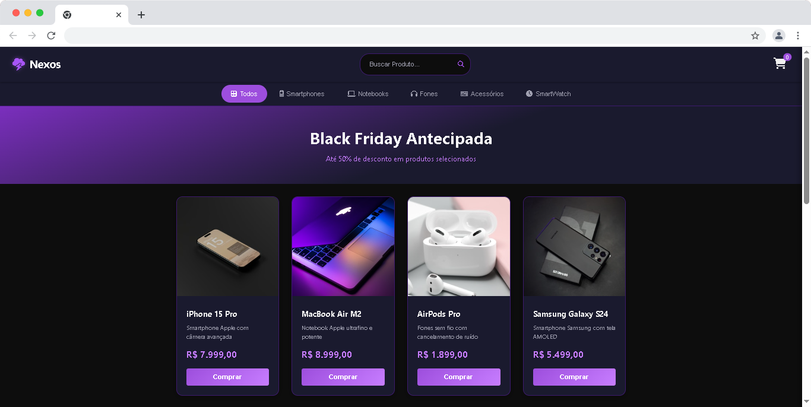
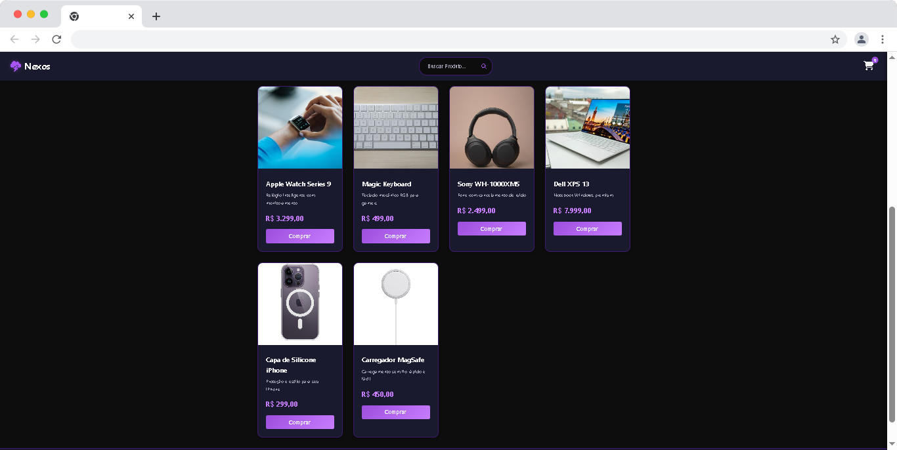
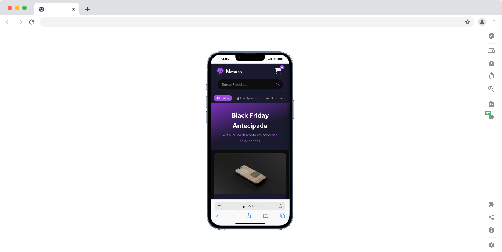

# ⚡ Nexos - E-Commerce Tech

A **Nexos** é uma interface de e-commerce moderna desenvolvida para o setor de tecnologia. O projeto foca em uma experiência de usuário (UX) fluida, com um layout responsivo e visual focado no modo escuro (dark mode).

## 🚀 Tecnologias Utilizadas

- **HTML5**: Estruturação semântica.
- **CSS3**: Estilização com Flexbox e Grid.
- **Font Awesome**: Ícones vetoriais para interface.
- **JavaScript**: (Em desenvolvimento) Lógica de carrinho e filtros.

## 🛠️ Funcionalidades

- [x] Cabeçalho fixo com busca integrada.
- [x] Banner promocional de "Black Friday Antecipada".
- [x] Filtro de categorias (Smartphones, Notebooks, etc).
- [x] Grade de produtos responsiva.
- [ ] Implementação de sistema de busca funcional.
- [ ] Página de detalhes do produto.

## 🎨 Layout

O design utiliza uma paleta de cores baseada em tons de roxo e preto profundo, transmitindo modernidade e inovação tecnológica.

## 📸 Demonstração do Projeto

### Desktop

### Mobile

## 📦 Como rodar o projeto
